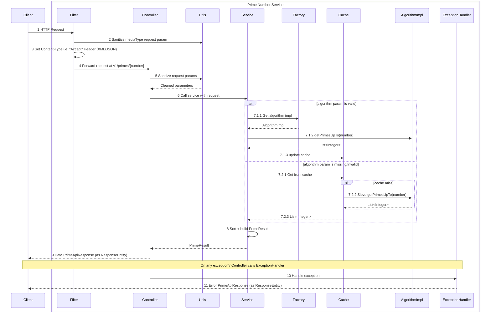

# Prime Number Service

RESTful Spring Boot microservice which calculates and returns all the prime numbers up to (
including) a number

## Requirements

| Key Point                                                                                                            | Comments                                                                                   |
|----------------------------------------------------------------------------------------------------------------------|--------------------------------------------------------------------------------------------|
| The project must be written in Java 8 or above                                                                       | Java 17                                                                                    |
| The project must use Maven OR Gradle to build, test and run                                                          | Maven                                                                                      |
| The project must have unit and integration tests                                                                     | Junit 5, Mockito, Cucumber                                                                 |
| The project must be runnable in that the service should be hosted in a container e.g. Tomcat, Jetty,Spring Boot etc. | Spring Boot 3.5.3 with embedded tomcat                                                     |
| The project must be accessible from Github                                                                           | [github_prime_number-service](https://github.com/latenightcoder1/prime-number-service.git) |

## Optional Extensions

| Key Point                                                                                                                      | Comments                                                                                                                |
|--------------------------------------------------------------------------------------------------------------------------------|-------------------------------------------------------------------------------------------------------------------------|
| Deploy the solution to a chosen platform that we can access                                                                    | [link](http://prime-alb-1829416646.eu-north-1.elb.amazonaws.com/v1/primes/1000?mediaType=xml&sort=desc&algorithm=sieve) |
| Consider supporting varying return content types such as XML based, that should be configurable using the requested media type | ?mediaType=xml                                                                                                          |
| Consider ways to improve overall performance e.g. caching results, concurrent algorithm                                        | Guava Cache                                                                                                             |
| Consider supporting multiple algorithms that can be switched based on optional parameters                                      | ?algorithm=sieve,?algorithm=trial                                                                                       |

## Solution

### Functional Aspect

- The service fetches all the primes up to a number.
- Currently supported algorithms - Sieve of Eratosthenes (sieve), Trial Division (trial).
- If requested with unknown or without algorithm details - fetched from locally managed cache.
- Cache default implementation is done using Sieve of Eratosthenes algorithm.
- Response are supported in two formats- xml and json.
- If requested with unknown or without format details - response would have default json format.
- Response can be arranged in ascending or in descending order based on request.
- Default ordering is ascending.
- Service throws Bad Request for any number less than 2 with message "${number} is less than 2"
- Service throws Bad Request for any number greater than 2,147,483,646 (Integer max limit-1) with
  message "${number} is greater than 2,147,483,646"

### Technical Aspect

- Primary technologies - Java 17, Spring Boot 3.5.3, Maven, Github
- Other technologies - Guava Cache, Lombok, Jackson, Jakarta validation, Spring-doc, Actuator,
  Markdown
- Deployment technologies- Google gib, Docker hub, AWS (ECS, Fargate, ALB)
- Testing frameworks- Junit 5, Cucumber, Gherkin, Mockito
- Swagger- [link](http://prime-alb-1829416646.eu-north-1.elb.amazonaws.com/swagger-ui/index.html)
- Health check api- [link](http://prime-alb-1829416646.eu-north-1.elb.amazonaws.com/actuator/health)

## Implementation

### Sequence Diagram



### API Design

| HTTP Method | API                                                                         | Response         |
|-------------|-----------------------------------------------------------------------------|------------------|
| GET         | http://localhost:8080/v1/primes/10?mediaType=json&algorithm=sieve&sort=desc | PrimeApiResponse |

### API Parameters & Object Model

| parameter | Type          | Optional | Details                                                                                                                                                  |
|-----------|---------------|----------|----------------------------------------------------------------------------------------------------------------------------------------------------------|
| number    | path variable | No       | Any value < 2 would lead to Bad request                                                                                                                  |
| mediaType | request param | Yes      | ignore cases<br> xml -> application/xml content type<br> json -> application/json content type<br> null or other values -> application/json content type |
| algorithm | request param | Yes      | ignore cases<br> sieve -> Sieve of Eratosthenes<br> trial -> Trial Division<br> null -> cache (cache miss uses sieve)                                    |
| sort      | request param | Yes      | ignore cases<br> desc -> descending order<br> asc -> ascending order<br> null or other values ->  ascending order                                        |

```java
public record PrimeApiResponse(
    PrimeResult data,
    ErrorDetails error
) {

    /**
     * Build PrimeApiResponse on success.
     *
     * @param data {@link PrimeResult}
     * @return {@link PrimeApiResponse}
     */
    public static PrimeApiResponse success(final PrimeResult data) {
        return new PrimeApiResponse(data, null);
    }

    /**
     * Build PrimeApiResponse on error.
     *
     * @param error {@link ErrorDetails}
     * @return {@link PrimeApiResponse}
     */
    public static PrimeApiResponse failure(final ErrorDetails error) {
        return new PrimeApiResponse(null, error);
    }
}

public record PrimeResult(int number, List<Integer> primes, String mediaType, String algorithm,
                          String sort, long timeTakenMs) {

}

public record ErrorDetails(int statusCode, String message) {

}
```

## Service Limitation

- It doesn't support response media type through header "Accept" from client.
- It supports only two prime calculation algorithms
- Pagination support is not available for now (helpful in dealing with very large number)

## Useful commands

- to build application- <b>mvn clean install</b>
- to build docker image & push to docker hub- <b>mvn compile jib:build</b>